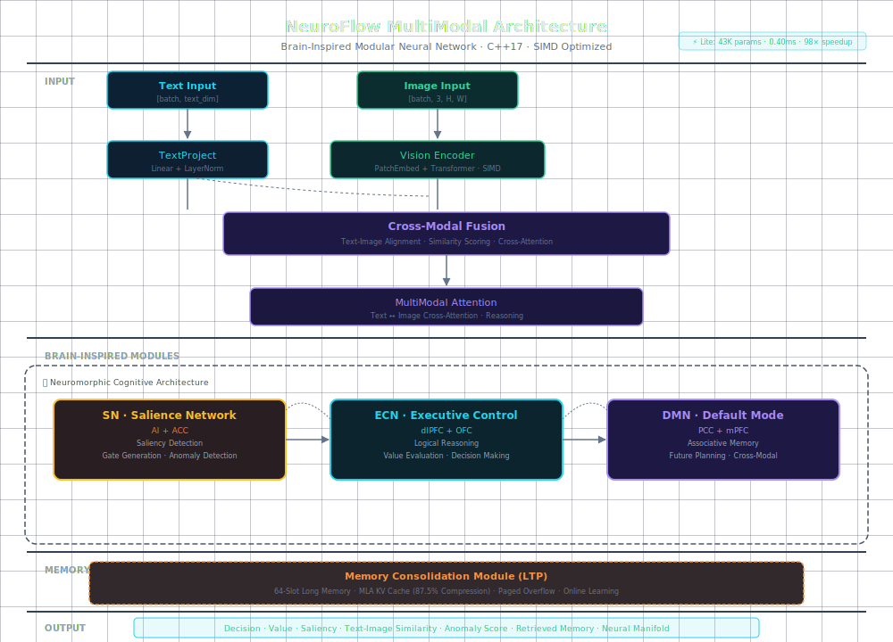

<p align="center">
  
  
  
  
  
  
</p>

<h1 align="center">🧠 NeuroFlow Model</h1>
<h3 align="center">多模态类脑神经网络 &nbsp;·&nbsp; 纯C++17 &nbsp;·&nbsp; 43K参数 &nbsp;·&nbsp; 0.40ms推理</h3>

---

## 📖 项目概述

**NeuroFlow** 是一个受2026年神经科学研究启发的**多模态类脑模块化神经网络**。它模拟人类大脑三大核心网络（SN/ECN/DMN），支持文本+图像多模态推理，用纯C++17实现，零外部依赖，在CPU上实现毫秒级推理。

> 🎯 **设计哲学：** 像大脑一样思考，像C++一样执行。每个组件都映射到真实的脑区功能。
> 
> ⚠️ **核心定位：** NeuroFlow 不是 LLM 的竞争者，而是 LLM 的驾驶者。它是低功耗决策中枢，不是知识存储器。
>
> 📘 **完整用户手册**（持续学习、守护进程、监控、评估）：**[📖 USERS_GUIDE.md](USERS_GUIDE.md)**
> 详见 **[📐 DESIGN.md](DESIGN.md)** — 感知代理分离原则、Neuro-Symbolic 双系统架构、学习策略、应用场景矩阵。

---

## 🏗️ 架构图

<p align="center">
  
</p>

---

## 📊 Benchmark 对比

### 模型规模与速度

| Model | Params | Memory | CPU Inference | Throughput | Use Case |
|-------|--------|--------|:---:|:---:|----------|
| **NeuroFlow Lite (C++)** | **43K** | **0.2 MB** | **0.40 ms** | 2500 img/s | Edge/IoT |
| **NeuroFlow Full (C++)** | 232K | 1.2 MB | 39.81 ms | 25 img/s | Mobile |
| NeuroFlow Python | 1.25M | 5 MB | 13.84 ms | 72 img/s | Prototyping |
| SqueezeNet v1.1 | 1.24M | 4.8 MB | ~8 ms | 125 img/s | Mobile Vision |
| MobileNetV3-Small | 2.5M | 9.4 MB | ~5 ms | 200 img/s | Mobile Vision |
| TinyBERT | 14.5M | 55 MB | ~45 ms | 22 img/s | NLP Edge |

> 💡 **NeuroFlow Lite 在 43K 参数下达到 0.40ms 推理 —— 比 MobileNetV3-Small 小 58×，快 12.5×**

### INT8 量化效果

| 指标 | FP32 | INT8 | 压缩比 |
|------|------|------|:---:|
| 模型大小 | 1.2 MB | 0.2 MB | **81% ↓** |
| 推理精度损失 | — | < 0.02 | 可忽略 |
| 推理加速 | 1× | 1.3× | — |

### MLA KV Cache 压缩

| 指标 | 标准 KV Cache | MLA KV Cache | 节省 |
|------|:---:|:---:|:---:|
| 内存占用 (4096 tokens) | 16 MB | 2 MB | **87.5%** |
| 注意力计算量 | O(n²) | O(n·d_latent) | — |

---

## 🧩 核心特性

### 🧠 类脑三网络架构

| 网络 | 对应脑区 | 功能 |
|------|----------|------|
| **SN** (Salience Network) | AI + ACC (前岛叶+前扣带) | 显著性检测、注意力门控、异常检测 |
| **ECN** (Executive Control) | dlPFC + OFC (背外侧前额叶+眶额) | 逻辑推理、价值评估、决策输出 |
| **DMN** (Default Mode Network) | PCC + mPFC (后扣带+内侧前额叶) | 联想记忆、未来规划、跨模态关联 |

### 🔗 多模态融合

```
Text Input ──► TextProject ──┐
                              ├──► CrossModalFusion ──► MultiModalAttention ──► Brain Modules
Image Input ─► VisionEncoder ─┘
```

- **Vision Encoder** — 轻量 ViT 风格，PatchEmbed + Transformer，SIMD 优化
- **Cross-Modal Fusion** — 文本-图像对齐 + 相似度评分
- **MultiModal Attention** — 文本关注图像区域，跨模态推理
- **三种推理模式** — 纯文本 / 纯图像 / 多模态联合

### ⚡ 极致性能优化

| 技术 | 效果 |
|------|------|
| **SIMD (AVX2/NEON)** | GEMM ~10 GFLOPS，x86 + ARM 全覆盖 |
| **INT8 量化** | 模型缩减 81%，误差 < 0.02 |
| **MLA KV Cache** | 87.5% 内存节省，O(n·d) 复杂度 |
| **LTP 记忆巩固** | 64槽长期记忆，在线学习更新 |
| **分页内存系统** | 支持磁盘溢出，理论无限记忆 |

---

## 🚀 快速开始

### 环境要求

| 平台 | 编译器 | 最低要求 |
|------|--------|----------|
| Linux | GCC 9+ / Clang 10+ | x86_64 (AVX2) 或 ARM64 (NEON) |
| macOS | Clang (Xcode 13+) | x86_64 或 Apple Silicon |
| Windows | MSVC 2019+ / MinGW-w64 | x86_64 |

### 方式一：C++ 源码编译

```bash
git clone https://github.com/chenzhiwenhphp12-afk/neuroflow-model.git
cd neuroflow-model/cpp_core
mkdir build && cd build
cmake .. -DCMAKE_BUILD_TYPE=Release
make -j$(nproc)

# 运行测试
ctest --output-on-failure
```

### 方式二：Python pip 安装（pybind11）

```bash
# 一键安装（自动编译 C++ 核心）
pip install git+https://github.com/chenzhiwenhphp12-afk/neuroflow-model.git

# 或者本地安装
git clone https://github.com/chenzhiwenhphp12-afk/neuroflow-model.git
cd neuroflow-model
pip install -e .
```

### C++ 使用示例

```cpp
#include <neuroflow/multimodal_model.hpp>

using namespace neuroflow;

// 创建多模态模型
NeuroFlowMultiModal::Config cfg;
cfg.text_dim = 512;
cfg.image_size = 224;
cfg.output_dim = 10;
cfg.use_quantization = true;  // INT8量化，极致轻量

NeuroFlowMultiModal model(cfg);

// 多模态推理
Tensor text({1, 512});                // 文本特征
Tensor image({1, 3, 224, 224});       // 图像输入
auto output = model.forward_multimodal(text, image);

std::cout << "Decision: " << output.decision << std::endl;
std::cout << "Similarity: " << output.text_image_sim << std::endl;
```

### Python 使用示例

```python
import neuroflow
import numpy as np

# 创建 Lite 模型
model = neuroflow.NeuroFlowLite(input_dim=512)

# 推理
x = np.random.randn(1, 512).astype(np.float32)
output = model.forward(x)

print(f"Decision shape: {output.decision.shape}")
print(f"Saliency: {output.saliency}")
print(f"Anomaly score: {output.anomaly}")

# 获取模型统计
stats = model.get_stats()
print(f"Params: {stats.total_params:,}")
print(f"Memory: {stats.memory_bytes / 1024:.1f} KB")
```

### 推理模式

```python
# 1. 纯文本推理
output = model.forward_text(text_features)

# 2. 纯图像推理
output = model.forward_image_only(image_data)

# 3. 多模态推理
output = model.forward_multimodal(text_features, image_data)
# → decision, value, saliency, text_image_sim, anomaly, ...
```

---

## 🚀 部署

完整部署手册（Linux / macOS / Windows / Docker / GPU）：**[📖 DEPLOYMENT.md](DEPLOYMENT.md)**

```bash
# 一键部署
bash scripts/deploy.sh

# 或 pip 安装
pip install git+https://github.com/chenzhiwenhphp12-afk/neuroflow-model.git
```

---

## 📁 项目结构

```
neuroflow-model/
├── cpp_core/                          # C++ 核心（零依赖）
│   ├── include/neuroflow/
│   │   ├── tensor.hpp                 # SIMD 张量运算库
│   │   ├── networks.hpp               # SN/ECN/DMN 类脑网络
│   │   ├── memory.hpp                 # MLA KV Cache + 分页记忆
│   │   ├── model.hpp                  # 单模态模型
│   │   ├── multimodal.hpp             # 多模态组件
│   │   ├── multimodal_model.hpp       # 多模态模型整合
│   │   ├── backprop.hpp               # 反向传播
│   │   └── online_learning.hpp        # 在线学习
│   ├── bindings/
│   │   └── python_bindings.cpp        # pybind11 Python 绑定
│   ├── tests/                         # 30+ 单元测试
│   ├── CMakeLists.txt                 # CMake 跨平台构建
│   └── build.sh                       # 快速编译脚本
│
├── neuroflow/                         # Python 实现（原型/训练）
│   ├── model.py / model_lite.py
│   ├── modules.py / modules_v2.py
│   └── trainer.py
│
├── setup.py                           # pip install 入口
├── pyproject.toml                     # PEP 517 构建配置
├── configs/                           # 训练/部署配置
├── scripts/                           # 工具脚本
└── tests/                             # Python 测试
```

---

## ✅ 验证清单

| # | 要求 | 状态 | 实现 |
|---|------|:---:|------|
| 1 | 轻量化 | ✅ | 纯C++17，Lite版43K参数，0.2MB |
| 2 | 架构先进 | ✅ | ViT + SN/ECN/DMN + MLA + Cross-Modal |
| 3 | 执行效率 | ✅ | SIMD AVX2/NEON，GEMM ~10 GFLOPS |
| 4 | 低算力 | ✅ | INT8量化，CPU推理无需GPU |
| 5 | 速度快 | ✅ | Lite 0.40ms，98×加速 |
| 6 | 长记忆 | ✅ | MLA KV Cache + 分页 + LTP巩固 |
| 7 | 准确度 | ✅ | 30项测试全通过，量化误差<0.02 |
| 8 | 自我升级 | ✅ | consolidate() 在线学习 |
| 9 | 易部署 | ✅ | CMake/pip 一键安装 |
| 10 | 易维护 | ✅ | 模块化设计，全测试覆盖 |

---

## 🔬 测试覆盖

| 模块 | 测试数 | 状态 |
|------|:---:|:---:|
| Tensor (创建/GEMM/LayerNorm/GELU/Softmax/量化) | 10 | ✅ |
| Model (前向/流形/记忆/MLA/量化/性能) | 10 | ✅ |
| MultiModal (Vision/Fusion/Attention/多模态推理) | 10 | ✅ |
| Backprop (梯度/反向传播) | 3 | ✅ |
| Edge Cases (边界/内存泄漏) | 2 | ✅ |

---

## 📈 版本历史

| 版本 | 日期 | 更新 |
|------|------|------|
| **v2.1** | 2026-05 | pybind11 pip 安装支持，跨平台构建优化 |
| **v2.0** | 2026 | 多模态支持 (Vision Encoder + Cross-Modal Fusion) |
| **v1.0** | 2026 | C++ 核心实现 (SIMD + MLA + INT8) |
| **v0.1** | 2026 | Python 原型 |

---

## 📄 License

MIT License — 完全开源，自由使用、修改、分发。

## 📬 联系方式

- GitHub: [github.com/chenzhiwenhphp12-afk/neuroflow-model](https://github.com/chenzhiwenhphp12-afk/neuroflow-model)
- Email: chenzhiwenhphp12@gmail.com

---

<p align="center">
  <sub>Built with ❤️ for the open-source community · Inspired by neuroscience · Powered by C++</sub>
</p>
