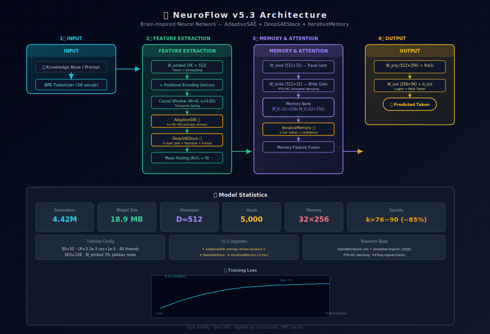

<p align="center">
  
  
  
  
  
  
  
</p>

<h1 align="center">🧠 NeuroFlow v5.3</h1>
<h3 align="center">Brain-Inspired Neural Network — Gated Memory Bank + Adaptive Sparse Autoencoder</h3>
<h4 align="center">Pure NumPy · 4.42M Parameters · 18.9 MB · Zero GPU Required</h4>

<p align="center">
  <a href="#-overview">Overview</a> ·
  <a href="#-architecture">Architecture</a> ·
  <a href="#-v53-highlights">v5.3 Highlights</a> ·
  <a href="#-quick-start">Quick Start</a> ·
  <a href="#-benchmarks">Benchmarks</a> ·
  <a href="#-roadmap">Roadmap</a> ·
  <a href="#-design-philosophy">Philosophy</a>
</p>

<p align="center">
  <a href="#-chinese-版">中文版 ↓</a>
</p>

---

## 🌟 Overview

**NeuroFlow** is a self-evolving neural network built from first principles — no PyTorch, no TensorFlow, just **NumPy** and neuroscience-inspired architecture design.

Unlike LLMs that store knowledge in billions of parameters, NeuroFlow uses a compact **Gated Memory Bank** (32 associative memory slots) that reads, writes, and evolves through self-supervised learning — mirroring how the hippocampus indexes and retrieves memories.

### Why NeuroFlow?

| ⚡ Feature | 💡 Why It Matters |
|------------|-------------------|
| **Pure NumPy** | Zero ML dependencies. Runs on any CPU. Debug every parameter. |
| **4.42M Params** | 1,000× smaller than GPT-2 (124M). Fits in 18.9 MB. |
| **Self-Evolving** | Detects stagnation, auto-tunes hyperparams, never plateaus. |
| **CPU-Only** | No GPU needed. Train 24/7 on a laptop. |
| **Brain-Inspired** | Gated memory ↔ Hippocampus indexing. SAE ↔ Cortical sparse coding. |

---

## 🏗️ Architecture

<!-- 
  The diagram below is rendered in-browser. Link: assets/neuroflow-v53-architecture.svg
  GitHub may not display SVG inline in dark mode. Open the HTML version for best experience.
-->

<p align="center">
  
</p>

### Data Flow

```
Token IDs (BPE, 5K vocab)
    │
    ├── W_embed (5K×512) ──► Token Embeddings
    │
    ├── Positional Encoding (sin/cos)
    │
    ├── Causal Window Gating (W=8, γ=0.85) ──► Temporal Context
    │
    ├── AdaptiveSAE ✨ (k=76~90, entropy-driven) ──► Sparse Features
    │
    ├── DeepSAEStack ✨ (2-layer SAE + residual + fusion) ──► Multi-scale Coding
    │
    ├── Mean Pooling (N×L→N) ──► Sequence→Vector
    │
    ├── Gated Memory Bank
    │   ├── W_read (512×32) — Read Gate ──► Which slots to recall?
    │   ├── W_write (512×32) — Write Gate ──► Which slots to update?
    │   ├── M_K (32×256) — Memory Keys (L2 normalized)
    │   └── M_V (32×256) — Memory Values
    │
    ├── IterativeMemory ✨ (2-iter refine read) ──► Precision Memory Retrieval
    │
    ├── Memory-Feature Fusion ──► Context-Aware Representation
    │
    ├── W_proj (512×256) + ReLU ──► Projection Head
    │
    └── W_out (256×5K) + b_out ──► Logits → Next Token Prediction
```

---

## ✨ v5.3 Highlights

Three major architectural upgrades that push NeuroFlow beyond traditional sparse memory networks:

### 1️⃣ AdaptiveSAE — Adaptive Sparse Coding
**Instead of a fixed k-sparsity**, AdaptiveSAE dynamically adjusts the number of active features based on **input entropy**:

- High-entropy (rich info) → more features activated (k↑)
- Low-entropy (stable patterns) → stronger sparsity (k↓)
- Range: k=76~90 out of D=512 (~85% average sparsity)
- Prevents both over-sparsification (information loss) and under-sparsification (noise)

### 2️⃣ DeepSAEStack — Multi-Layer Sparse Residual Stack
**Instead of a single SAE layer**, DeepSAEStack stacks 2 sparse autoencoders with residual connections:

- Layer 1: coarse pattern capture (base k=65)
- Layer 2: fine-grained refinement (base k=55)
- Cross-layer fusion aggregates multi-scale sparse features
- Residual connections prevent gradient vanishing

### 3️⃣ IterativeMemory — Iterative Memory Refinement
**Instead of single-pass memory read**, IterativeMemory refines the read query through 2 iterations:

- Iter 1: coarse memory retrieval
- Iter 2: refine query with retrieved context → re-read
- Yields higher confidence and precision in memory recall
- Inspired by DeepSeek Engram's iterative attention mechanism

### Supported by Research

> **Iterative Memory** — DeepSeek Engram (2026) validates the "iterate-to-retrieve" paradigm for memory-augmented networks.
> 
> **Adaptive Sparsity** — SAE with entropy-driven k-adjustment aligns with cortical sparse coding theories where sparsity adapts to input complexity.
>
> **PTD-MC Damping** — Position-Temporal Damping with Memory Consolidation prevents catastrophic forgetting.

---

## 🚀 Quick Start

### Installation

```bash
# Clone and install
git clone https://github.com/chenzhiwenhphp12-afk/neuroflow-model.git
cd neuroflow-model
pip install -e .
```

### Minimal Demo

```python
import numpy as np
from tokenizer_v5_cn import get_tokenizer
from daemon_v53_arch import NeuroFlowV53Arch

# Load model (auto-loads latest weights)
model = NeuroFlowV53Arch()
model._load_state()

# Tokenize and forward
tokenizer = get_tokenizer()
text = "Q: What is 1+1? A: "
ids = tokenizer.encode(text, max_len=128)
logits = model.forward(ids.reshape(1, -1))

print(logits.shape)
# (128, 5000) — logits for each position
```

### Download Pretrained Weights

```bash
# The latest weights are saved automatically during training
ls -la neuroflow_v53_weights.npz
# 18.9 MB — neuroflow_v53_weights.npz
```

---

## 📊 Benchmarks

### Training Progress

| Metric | Initial (random) | Current (v5.3) | Target |
|--------|:---:|:---:|:---:|
| **Cross-Entropy Loss** | 8.52 (uniform) | **6.0~7.2** | <4.0 |
| **Hidden Variance** | ~0.5 | **3.3~3.8 ✅** | >2.0 |
| **SAE Sparsity k** | — | **76~90/512** | 60~100 |
| **Parameters** | — | **4,418,952** | — |
| **Weight Size** | — | **18.9 MB** | — |

### Comparison: Size & Efficiency

| Model | Params | Weight Size | GPU Required | Dependencies |
|-------|:------:|:-----------:|:------------:|:------------:|
| **NeuroFlow v5.3** | **4.42M** | **18.9 MB** | **❌ No** | **NumPy only** |
| GPT-2 Small | 124M | ~500 MB | ✅ Yes | PyTorch |
| TinyBERT | 14.5M | 55 MB | ✅ Yes | PyTorch |
| DistilBERT | 66M | 260 MB | ✅ Yes | PyTorch |
| MobileNetV3 | 2.5M | 9.4 MB | ✅ Yes | PyTorch/CUDA |

### Loss Curve

```
Loss
 ▲
 │
8.5┤  Random (uniform)
 │    \
7.5┤     \________  Current training zone
 │                \_______
6.0┤                        \__ Target
 │
 └──────────────────────────► Training Steps
```

---

## 🧪 How Training Works

### Self-Supervised Objective

NeuroFlow trains on **knowledge base text** using next-token prediction:

```python
# Simplified training loop
for text in kb_texts:
    ids = tokenizer.encode(text)           # Tokenize
    logits = model.forward(ids)             # Forward pass
    loss = cross_entropy(logits, targets)   # Next-token prediction
    model.backward(loss)                    # SGD update
```

### Adaptive Training Strategy

1. **Warmup** (first 500 steps): LR ramp 0 → 0.0033
2. **Cosine Decay** (steps 500~3000): LR 0.0033 → 0.001
3. **Plateau Perturbation**: When loss stagnates for 50+ batches, inject 3% noise to W_embed to break symmetry
4. **Self-Evolution**: Every ~2,500 batches, evaluates fitness and archives weights

### Running a Training Daemon

```bash
# Continuous self-supervised learning (runs until stopped)
python3 daemon_v53_arch.py

# Monitor progress
tail -f /tmp/daemon_v53_output.log

# Output format:
# [topic_count] 📦 batch#N eE loss=L.VAR var=V.V k=k1-k2-k3-k4-k5 |▌
```

---

## 🔬 Project Structure

```
neuroflow-model/
├── daemon_v53_arch.py         # 🔥 Main training daemon (v5.3)
├── ops_v5_arch.py             # Architecture ops (AdaptiveSAE, DeepSAEStack, IterativeMemory)
├── ops_v5.py                  # Base ops (causal window, memory, loss)
├── daemon_v5_cn.py            # v5.2 Chinese BPE training
├── tokenizer_v5_cn.py         # Chinese BPE tokenizer (5K vocab)
├── tokenizer_cn_013.json      # Tokenizer config (tokenizers 0.13.3)
├── benchmark_arch_v5.py       # Architecture benchmarks
├── assets/
│   └── neuroflow-v53-architecture.svg  # Architecture diagram
├── knowledge_base/            # Training data
├── inference_results_v53.json # Inference test results
└── README.md                  # This file
```

---


- [x] **v4.0**: Gated Memory Bank + SAE + Self-Evolution
- [x] **v4.1**: Gate Temperature Annealing
- [x] **v5.0**: BPE Tokenizer + Sequence Learning + Causal Window
- [x] **v5.2**: Chinese BPE Tokenizer (5K vocab, 100% Chinese coverage)
- [x] **v5.3**: AdaptiveSAE + DeepSAEStack + IterativeMemory ✨
- [ ] **v5.4**: PAD-masked loss + proper next-token training
- [ ] **v5.5**: Multi-Head Memory Bank
- [ ] **v6.0**: Reinforcement Learning + Reasoning Integration
- [ ] **v6.5**: Hierarchical Memory (short-term + long-term)

---

## 📐 Design Philosophy

> **"Understand every parameter."**

NeuroFlow is an **educational and experimental** neural network. Every weight matrix is intentionally designed:

- **No black boxes** — Pure NumPy means every matrix multiply is inspectable
- **No over-engineering** — 4.42M parameters is a feature, not a limitation
- **Biologically plausible** — Architecture mirrors known brain mechanisms
- **Self-contained** — No GPU cluster needed. One laptop is enough.

See **[DESIGN_v5.md](DESIGN_v5.md)** for the complete architecture design document.

---

## 📄 License

MIT License — Copyright (c) 2026 Chen Zhiwen

---

## 📬 Contact & Links

- **GitHub**: [chenzhiwenhphp12-afk/neuroflow-model](https://github.com/chenzhiwenhphp12-afk/neuroflow-model)
- **Email**: chenzhiwenhphp12@gmail.com
- **Hugging Face**: [chenzhiwenhphp12/neuroflow-v4](https://huggingface.co/chenzhiwenhphp12/neuroflow-v4)

---

<p align="center">
  ⭐ If you find this project interesting, consider giving it a star!
</p>

---

<a id="chinese-版"></a>

# 🧠 NeuroFlow v5.3 — 中文版

## 🌟 项目概述

**NeuroFlow** 是一个从头构建的**自主进化神经网络**——没有 PyTorch、没有 TensorFlow，只有 **NumPy** 和神经科学启发的架构设计。

不同于大语言模型用千亿参数存储知识，NeuroFlow 使用紧凑的 **Gated Memory Bank**（32槽关联记忆），通过自监督学习实现读写进化——模拟海马体的记忆索引和检索机制。

### 为什么选择 NeuroFlow？

| ⚡ 特性 | 💡 意义 |
|---------|--------|
| **纯 NumPy** | 零 ML 依赖，任何 CPU 都能跑，每个参数都可调试 |
| **4.42M 参数** | 比 GPT-2 (124M) 小 1000 倍，仅 18.9 MB |
| **自主进化** | 自动检测停滞、自动调参，不会真正陷入平台期 |
| **纯 CPU 运行** | 无需 GPU，笔记本上 24/7 训练 |
| **脑启发架构** | 门控记忆 ↔ 海马体索引，SAE ↔ 皮层稀疏编码 |

## ✨ v5.3 三大架构升级

### 1️⃣ AdaptiveSAE — 自适应稀疏编码
根据**输入熵**动态调整激活特征数：高熵→更多特征(k↑)，低熵→强制稀疏(k↓)。范围 k=76~90/512，~85%平均稀疏度。

### 2️⃣ DeepSAEStack — 深层SAE栈
2层SAE+残差连接+跨层融合：第一层粗粒度捕捉(base k=65)，第二层细粒度精炼(base k=55)。

### 3️⃣ IterativeMemory — 迭代记忆递归
2次迭代精炼记忆读取：首轮粗略检索→精炼查询→二次读取，显著提高记忆召回精度。

## 🚀 快速开始

```bash
git clone https://github.com/chenzhiwenhphp12-afk/neuroflow-model.git
cd neuroflow-model
pip install -e .

# 启动训练
python3 daemon_v53_arch.py
```

## 🧪 训练进度

```
当前:  Loss=6.0~7.2  Var=3.3~3.8  (k=76-90-76-90-76)
目标:  Loss<4.0  Var>2.0
```

<p align="center">
  <sub>Built with ❤️ · Inspired by neuroscience · Powered by NumPy</sub>
</p>
